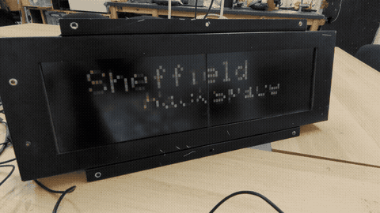
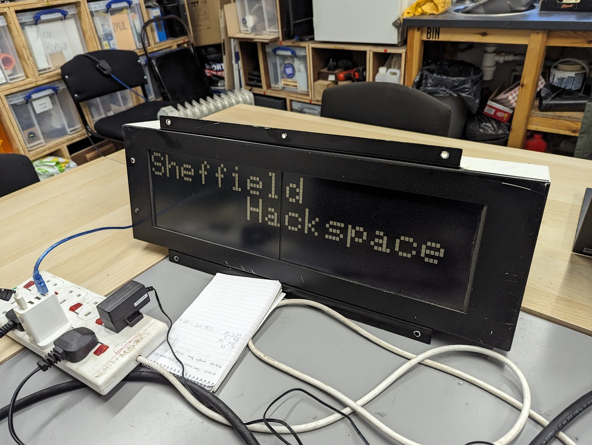
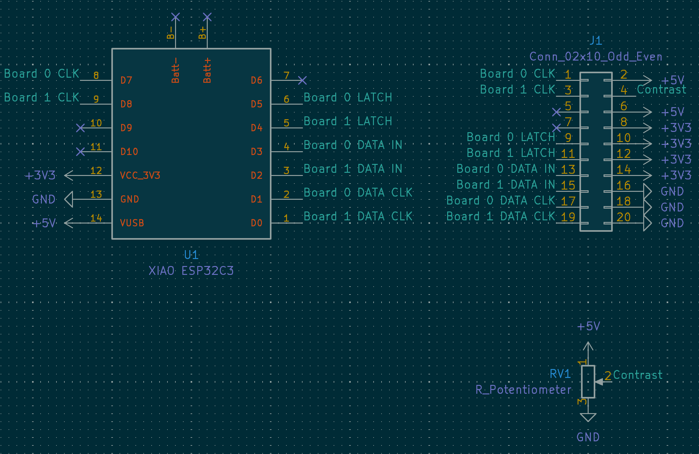
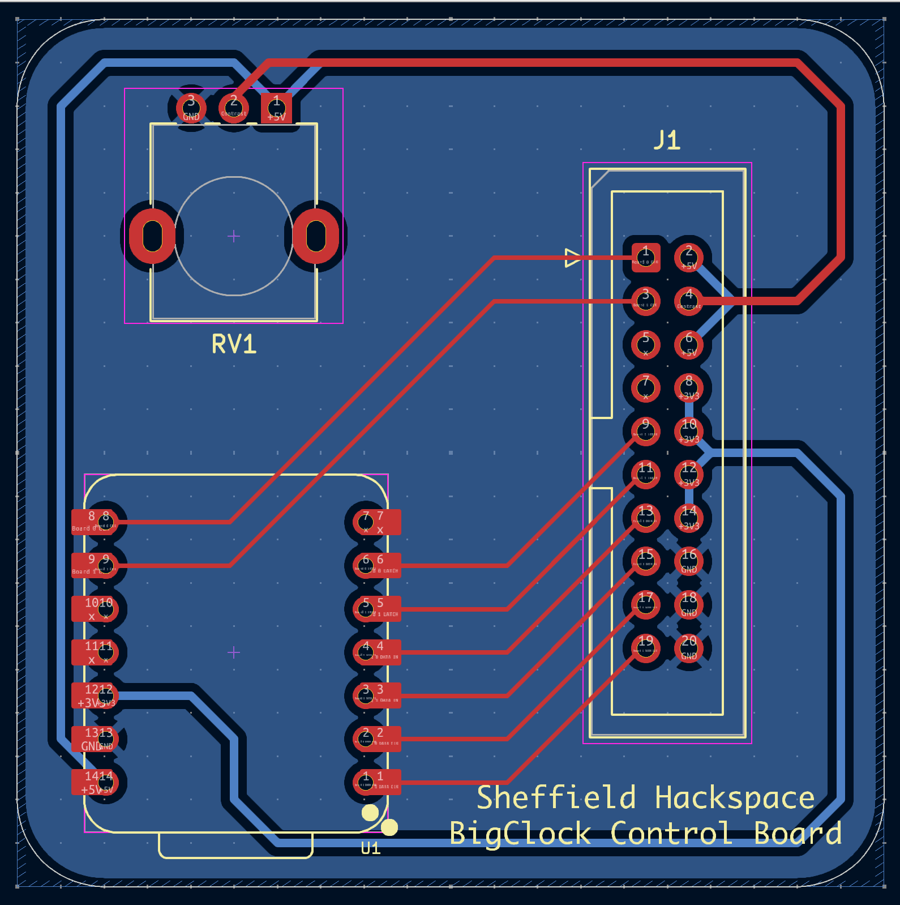
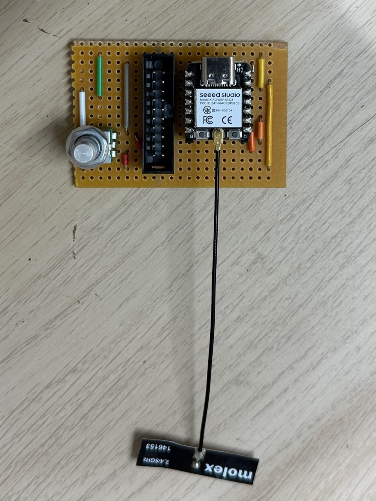

# AEGMIS_GV60

An Adafruit GFX compatible driver for the AEGMIS GV60 train station dot matrix display.





## Hardware

* Display dimensions: 96 × 26
* Operating voltage: 3.3V
* Power voltage: 5V

### Schematic



See the [KiCad project](./kicad) for the full schematic.

### PCB Design



### Prototype



## Installation

Add the following to your `platformio.ini`:

```ini
lib_deps =
    adafruit/Adafruit BusIO
    adafruit/Adafruit GFX Library
    https://github.com/sheffieldhackspace/AEGMIS_GV60
```

## Dependencies

* [Adafruit BusIO](https://github.com/adafruit/Adafruit_BusIO)
* [Adafruit GFX Library](https://github.com/adafruit/Adafruit-GFX-Library)
* ESP32 with FreeRTOS (required for the keepalive task)

## Usage

```cpp
#include <AEGMIS_GV60.h>

AEGMIS_GV60_SPI spi1(D1, D3, D5, D8);
AEGMIS_GV60_SPI spi2(D0, D2, D4, D7);
AEGMIS_GV60 display(&spi1, &spi2);

void setup() {
    display.begin();
    display.fillScreen(0);
    display.setCursor(0, 0);
    display.print("Hello");
    display.display();
}

void loop() {
    // update display as needed
    display.display();
}
```

Since `AEGMIS_GV60` inherits from `GFXcanvas1`, the full [Adafruit GFX API](https://learn.adafruit.com/adafruit-gfx-graphics-library) is available for drawing text, shapes, and bitmaps. Call `display.display()` to flush the canvas to the hardware.

## Examples

Three examples are included in the `examples/` directory. To build and flash them, clone the repository and run:

```bash
# Show a hardware test pattern
pio run -t upload -e test

# Show a checkerboard pattern
pio run -t upload -e checkerboard

# Scroll two lines of text around the display
pio run -t upload -e movingwords
```

## Acknowledgements

Inspired by the BigClock library by Daniel Swann (Nottingham Hackspace), available at
https://github.com/daniel1111/BigClockSnake. The reverse engineering work of the display's
segment layout and SPI protocol was instrumental in the development of this library.
